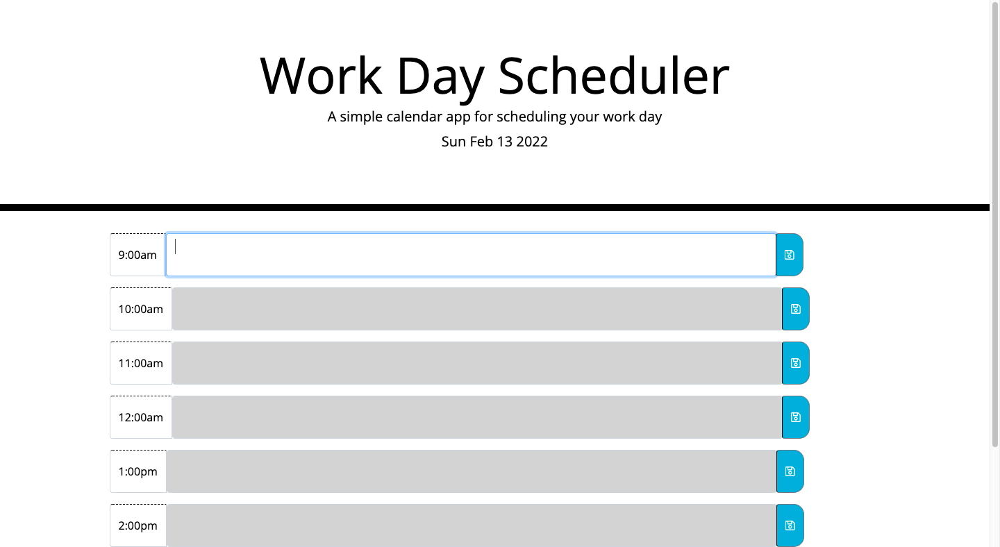

Challenge 5

For this weeks challenge I wrote the javascript of a weekday scheduler. The scheduler allows the user to input tasks that will be saved as persistent data into localStorage. The user writes their task into a timeslot (9:00 AM to 4:00PM) and the slot changes color depending on the time of the day to reflect current, past, and future tasks. The application also displays the current date and time. 

github repo: https://github.com/GDav24/workday-scheduler

application URL: https://gdav24.github.io/workday-scheduler/

